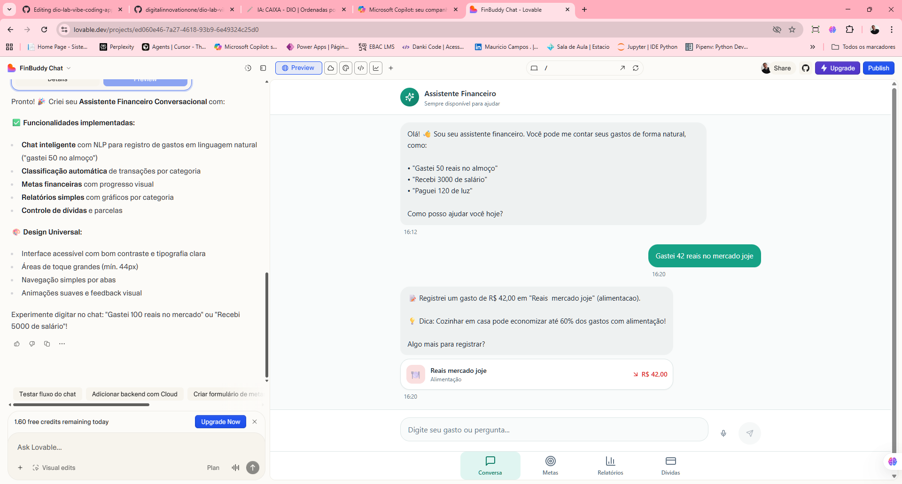
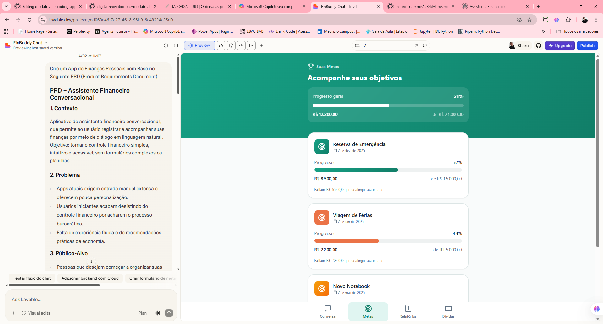
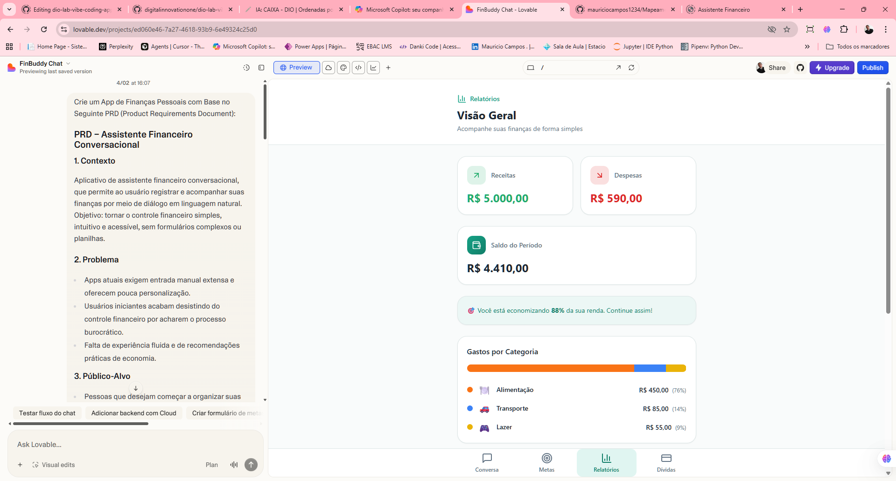
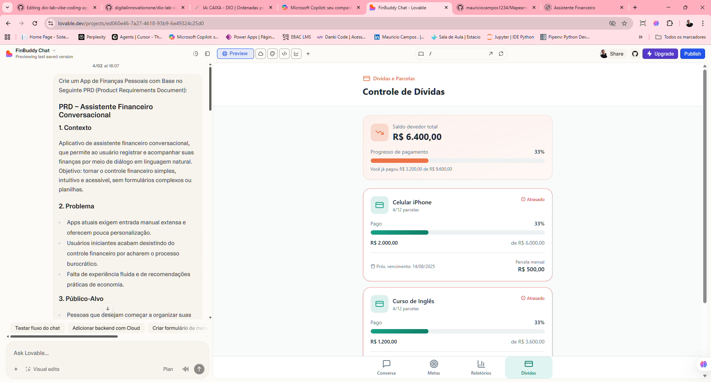

# 💸 App de Organização de Finanças Pessoais com Vibe Coding

**criar soluções com IA** de forma criativa, guiando ferramentas como o **Copilot** e o **Lovable** com uma comunicação simples e natural. O foco é desenvolver o conceito de um **App de Organização de Finanças Pessoais**, mas, acima de tudo, aprender o **jeito Vibe de programar com IA**.

## ✨ O que é Vibe Coding

**Vibe Coding** é uma forma leve e criativa de desenvolver com IA, baseada em **conversas naturais e bem estruturadas**. Você não precisa escrever código linha por linha. Em vez disso, aprende a **guiar a IA** descrevendo suas ideias de forma clara, com **intenção e contexto**. Em outras palavras:

> Você mostra a vibe da sua ideia e a IA transforma em solução (ou em um caminho para ela).

## 🎯 Desafio

Problema: Muitas pessoas não conseguem manter um controle financeiro porque os aplicativos exigem muita entrada de dados manual, e a criação de orçamentos é vista como algo tedioso. 

Precisamos de uma solução que permita **controlar as finanças por meio de uma conversa simples**, com **agentes de IA** capazes de criar **planos de economia personalizados e automatizados**. Você deve utilizar as ideias de **Vibe Coding** e **MVP (Produto Mínimo Viável)** para desenvolver o **conceito de um aplicativo** que resolva o problema citado.

> [!IMPORTANT]
> Você **não precisa construir o código**! O foco está em **usar a IA como sua parceira criativa**, transformando boas ideias e prompts em conceitos funcionais que simulam um produto real.

## 🪄 Etapas do Desafio

### 1. Saber o que Pedir é a Chave! Otimize seus Prompts!

Antes de pedir para a IA "criar um app", é importante definir com clareza o que você quer construir e por quê. Para isso, você vai criar um **PRD (Product Requirements Document)** simplificado, uma especificação que serve como _briefing_ para a IA entender sua ideia.

Um bom PRD deve descrever o problema, quem será beneficiado, as principais funcionalidades e o que você espera que a IA entregue. Use o modelo abaixo como ponto de partida e adapte conforme o seu estilo:

# Contexto
Crie um App de Finanças Pessoais com Base no Seguinte PRD (Product Requirements Document):

PRD – Assistente Financeiro Conversacional
### 1. Prompt
Aplicativo de assistente financeiro conversacional, que permite ao usuário registrar e acompanhar suas finanças por meio de diálogo em linguagem natural.
Objetivo: tornar o controle financeiro simples, intuitivo e acessível, sem formulários complexos ou planilhas.

### 2. Problema
Apps atuais exigem entrada manual extensa e oferecem pouca personalização.
Usuários iniciantes acabam desistindo do controle financeiro por acharem o processo burocrático.
Falta de experiência fluida e de recomendações práticas de economia.

### 3. Público-Alvo
Pessoas que desejam começar a organizar suas finanças de forma prática.
Usuários iniciantes que buscam simplicidade e orientação personalizada.
Pessoas que preferem interações naturais em vez de interfaces tradicionais.
Nota importante: o app deve seguir princípios de Design Universal, garantindo boa experiência para o maior número possível de usuários, independentemente de idade, nível de habilidade digital ou necessidades específicas de acessibilidade.

### 4. Funcionalidades-Chave
Registro de gastos via chat em linguagem natural.
Classificação automática das transações.
Definição e acompanhamento de metas financeiras.
Agente Financeiro: dicas personalizadas de economia.
Relatórios simples e visuais, adaptados ao perfil do usuário.
Design Universal: interface inclusiva, com linguagem clara, acessibilidade (voz, contraste, navegação simples) e flexibilidade de uso.
Registro de dívidas e compras parceladas (com ou sem juros), acompanhando parcelas já pagas e saldo restante.

### 5. MVP – Entregáveis
Principais telas:
Tela de chat.
Tela de metas financeiras.
Tela de relatórios.
Recursos necessários:
NLP para conversas.
Motor de categorização automática.
Sistema de metas e alertas.
Relatórios visuais acessíveis.
Registro de dívidas e parcelas.
Validação inicial:
Testes com usuários iniciantes e diversos perfis (incluindo pessoas com baixa familiaridade digital).
Coleta de feedback sobre clareza, acessibilidade e utilidade das dicas.
Ajustes rápidos no fluxo de chat e relatórios.

### 6. Conceito de Design Universal
Definição: abordagem de criação de produtos e serviços que busca ser usável pelo maior número possível de pessoas, sem necessidade de adaptações especiais.
Princípio central: em vez de pensar em “usuários típicos” e depois criar versões adaptadas, o Design Universal já nasce inclusivo e acessível.
Exemplos práticos:
Interfaces com contraste adequado para pessoas com baixa visão.
Textos claros e simples, sem jargões técnicos.
Opções de entrada por voz ou toque.
Navegação intuitiva, sem excesso de passos.
Benefício: aumenta a satisfação geral, reduz barreiras e amplia o alcance do produto.

### 2. Explorando o Lovable na Prática

## 💬 Conclusão

Vibe Coding é sobre clareza, curiosidade e criatividade, não sobre perfeição técnica. O verdadeiro objetivo aqui é aprender a pensar junto com a IA, transformando ideias em conceitos reais e enxergando a tecnologia como uma extensão do seu raciocínio criativo. Cada interação é um experimento, quanto mais clara for sua intenção, mais surpreendente será o resultado.
